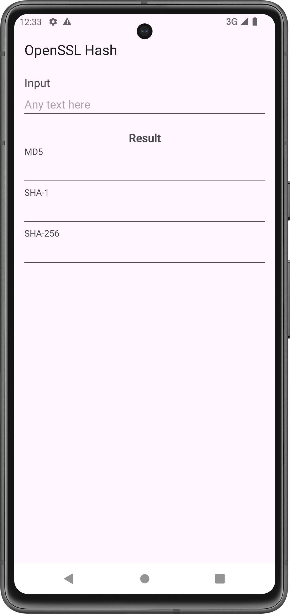

# OpensslDemo

Simple demonstration of kotlin android app using openssl (static) via jni.

Tested features:
- hash (md5, sha1, sha256)
- ...

---
### why?
perfomance & obscurity. frankly, try to use native code whenever possible for sensitive operations 😃

### reproduction steps
1. build the static libraries first and put to `/app/src/main/cpp/prebuilt` for each ABI (see `openssl_build`)
2. put openssl header folders to `/app/src/main/cpp/openssl_include`
3. open project in Android Studio
3. run & voila

